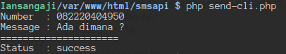
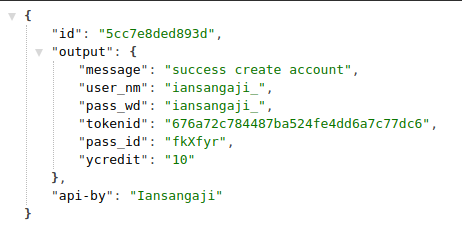
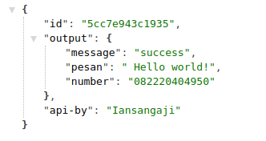

# smsend-project
This is simple tools for send message using php. 

# get username for send
Url : https://api.iansangaji.co/sms/create_akun.php?nama=yourname

# api send message
Url : https://api.iansangaji.co/sms/sms.php?pesan=MESSAGE&no=NUMBER&user=your_username

